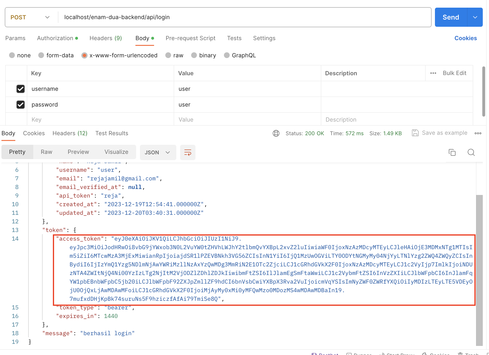
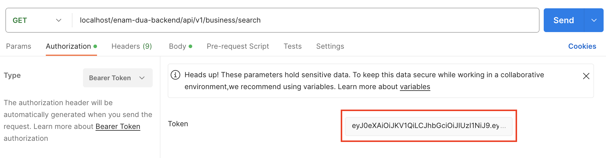
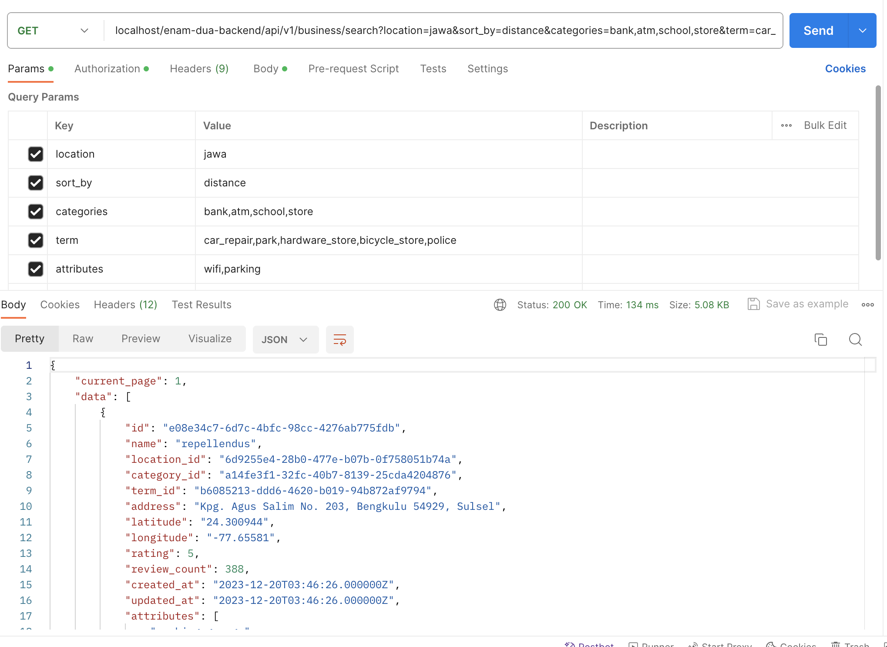
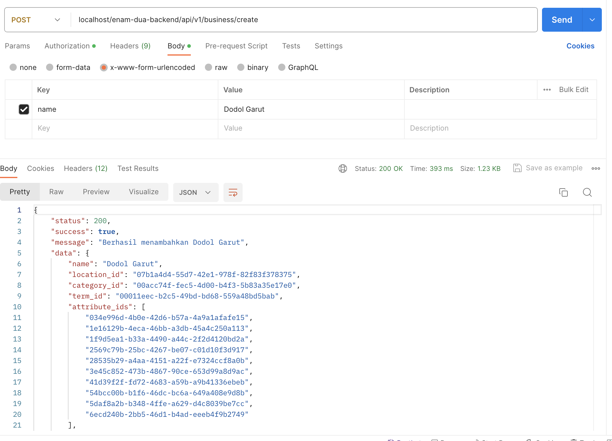
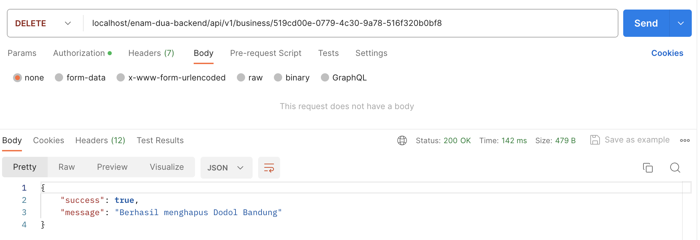

## Project Setup


##### 1. Install Composer
```sh
composer install
```

##### 2. Migrate Database
```sh
php artisan migrate
```

##### 4. Run Table Seeder
```sh
php artisan db:seed
```

##### 5. Run Business Seeder
```sh
php artisan db:seed --class=BusinessSeeder
```

##
## DATABASE


```sh
MySQL
```

##
## GET CLIENT TOKEN


```sh
POST localhost/project/api/login
```

```
username : user
password : user
```


Copy Token and Paste to `Authorization -> Bearer Token -> Token`


##
## PROJECT TEST
### 1. Search Business
Make sure the Token is in present
```sh
GET localhost/project/api/v1/business/search
```
#### - Parameters :
| Name         | Type                     | Required |
|--------------|:-------------------------|:--------:|
| location     | String                   | ✅        |
| sort_by      | String (Comma Separator) | ❌        |
| categories   | String (Comma Separator) | ❌        |
| term         | String (Comma Separator) | ❌        |
| attributes   | String (Comma Separator) | ❌        |



##
### 2. Create New Business
Make sure the Token is in present
```sh
POST localhost/project/api/v1/business/create
```
#### - Payloads :
| Name          | Type                     | Required |
|---------------|:-------------------------|:--------:|
| name          | String                   | ✅        |
| location_id   | String                   | ❌        |
| category_id   | String                   | ❌        |
| term_id       | String                   | ❌        |
| attribute_ids | Array String             | ❌        |
| address       | String                   | ❌        |
| latitude      | String                   | ❌        |
| longitude     | String                   | ❌        |



##
### 3. Edit Business
Make sure the Token is in present
```sh
PUT localhost/project/api/v1/business/{id}
```
#### - Payloads :
| Name          | Type                     | Required |
|---------------|:-------------------------|:--------:|
| name          | String                   | ✅        |
| location_id   | String                   | ❌        |
| category_id   | String                   | ❌        |
| term_id       | String                   | ❌        |
| attribute_ids | Array String             | ❌        |
| address       | String                   | ❌        |
| latitude      | String                   | ❌        |
| longitude     | String                   | ❌        |


##
### 4. Delete Business
Make sure the Token is in present
```sh
DELETE localhost/project/api/v1/business/{id}
```
